# KoboldCpp Technical Architecture

This document provides a comprehensive technical overview of KoboldCpp's architecture, covering system components, data flow, API design, and integration patterns.

## Table of Contents

1. [System Overview](#system-overview)
2. [Core Architecture](#core-architecture)
3. [Component Interactions](#component-interactions)
4. [API Architecture](#api-architecture)
5. [Data Flow](#data-flow)
6. [Backend Integration](#backend-integration)
7. [OpenCog Cognitive Architecture](#opencog-cognitive-architecture)
8. [Build and Deployment](#build-and-deployment)
9. [Performance Optimization](#performance-optimization)
10. [Security Considerations](#security-considerations)

## System Overview

KoboldCpp is a comprehensive AI text-generation platform that combines multiple AI capabilities into a single executable. It builds upon llama.cpp and integrates various AI models and cognitive architectures.

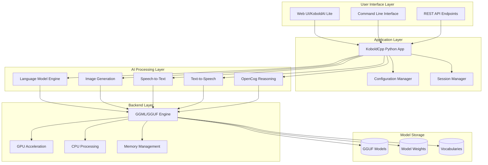

## Core Architecture

### Main Components

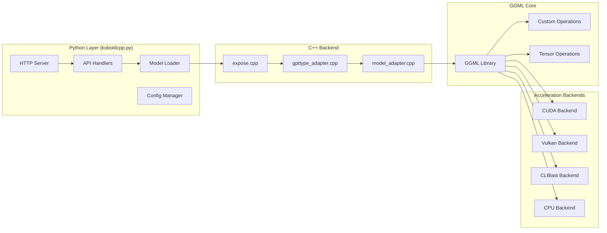

### Key Design Patterns

1. **Layered Architecture**: Clear separation between UI, application logic, and backend processing
2. **Plugin Pattern**: Modular backends for different acceleration methods
3. **Adapter Pattern**: Uniform interface for different model types
4. **Factory Pattern**: Dynamic model loading and initialization
5. **Observer Pattern**: Event-driven updates for UI and monitoring

## Component Interactions

### Text Generation Flow

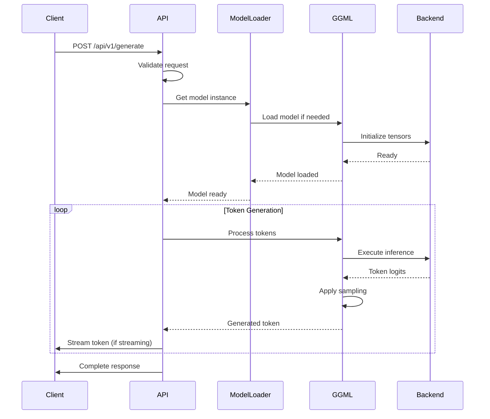

### Model Loading Process

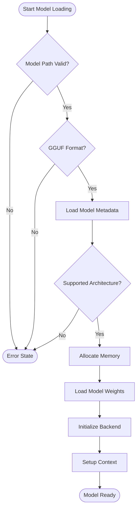

## API Architecture

### REST API Structure

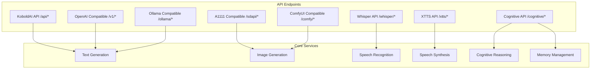

### API Request Flow

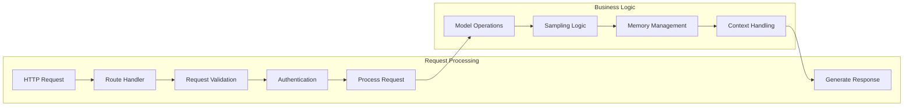

## Data Flow

### Memory Architecture

```mermaid
graph TB
    subgraph "Host Memory"
        SYSTEM_RAM[System RAM]
        MODEL_CACHE[Model Cache]
        CONTEXT_BUFFER[Context Buffer]
        RESPONSE_QUEUE[Response Queue]
    end
    
    subgraph "GPU Memory (if available)"
        VRAM[GPU VRAM]
        GPU_CACHE[GPU Cache]
        TENSOR_BUFFERS[Tensor Buffers]
    end
    
    subgraph "Storage"
        MODEL_FILES[Model Files (.gguf)]
        CONFIG_FILES[Configuration]
        LOGS[Application Logs]
    end
    
    MODEL_FILES --> MODEL_CACHE
    MODEL_CACHE --> VRAM
    MODEL_CACHE --> TENSOR_BUFFERS
    CONTEXT_BUFFER --> GPU_CACHE
    SYSTEM_RAM --> VRAM
    RESPONSE_QUEUE --> SYSTEM_RAM
    CONFIG_FILES --> SYSTEM_RAM
```

### Token Processing Pipeline

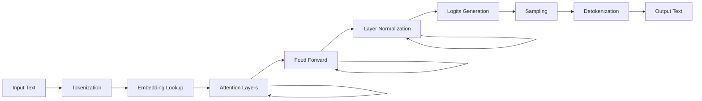

## Backend Integration

### GPU Acceleration Backends

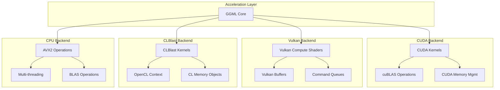

### Model Adapter System

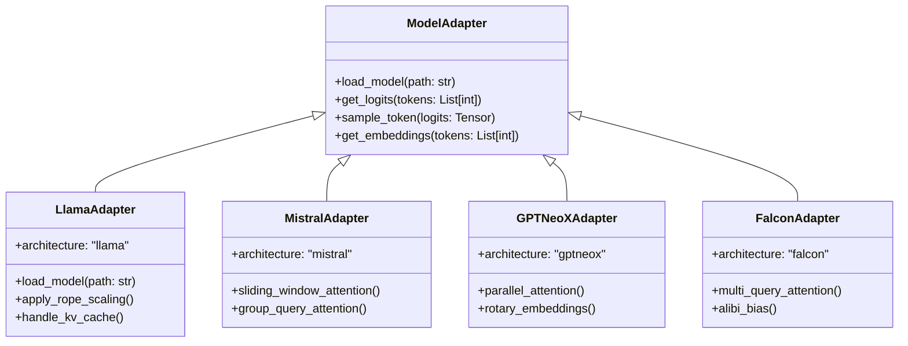

## OpenCog Cognitive Architecture

### Cognitive Processing Flow

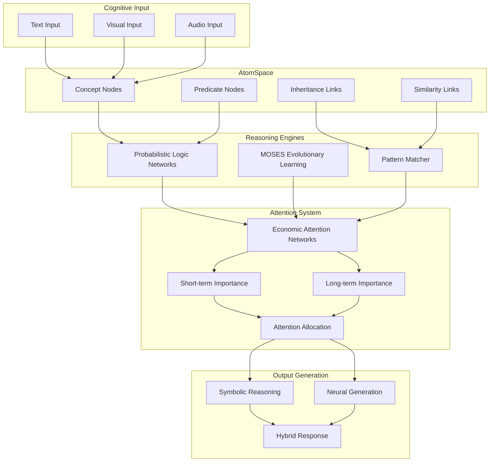

### Tensor-AtomSpace Integration

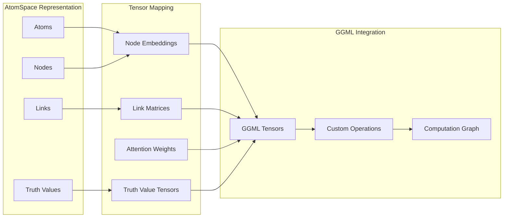

## Build and Deployment

### Build Process

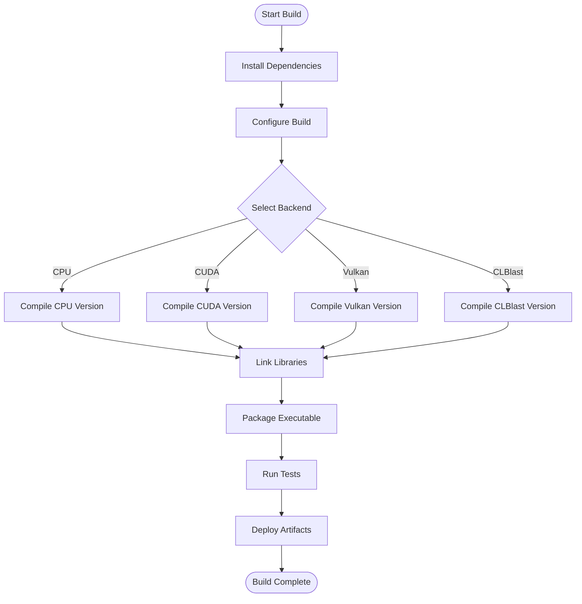

### Deployment Architecture

```mermaid
graph TB
    subgraph "Distribution Methods"
        STANDALONE[Standalone Executable]
        DOCKER[Docker Container]
        COLAB[Google Colab]
        RUNPOD[RunPod Cloud]
        NOVITA[Novita AI Cloud]
    end
    
    subgraph "Platform Support"
        WINDOWS[Windows x64]
        LINUX[Linux x64]
        MACOS[macOS ARM64/x64]
        ANDROID[Android (Termux)]
    end
    
    subgraph "Build Variants"
        CPU_BUILD[CPU Only]
        CUDA_BUILD[CUDA Enabled]
        VULKAN_BUILD[Vulkan Enabled]
        FULL_BUILD[All Backends]
    end
    
    STANDALONE --> WINDOWS
    STANDALONE --> LINUX
    STANDALONE --> MACOS
    
    DOCKER --> LINUX
    COLAB --> LINUX
    RUNPOD --> LINUX
    NOVITA --> LINUX
    
    WINDOWS --> CPU_BUILD
    WINDOWS --> CUDA_BUILD
    WINDOWS --> VULKAN_BUILD
    LINUX --> FULL_BUILD
    MACOS --> CPU_BUILD
    ANDROID --> CPU_BUILD
```

## Performance Optimization

### Memory Optimization Strategies

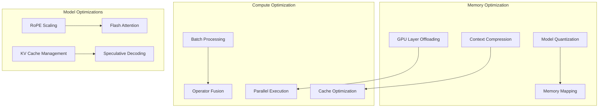

### Scaling Architecture

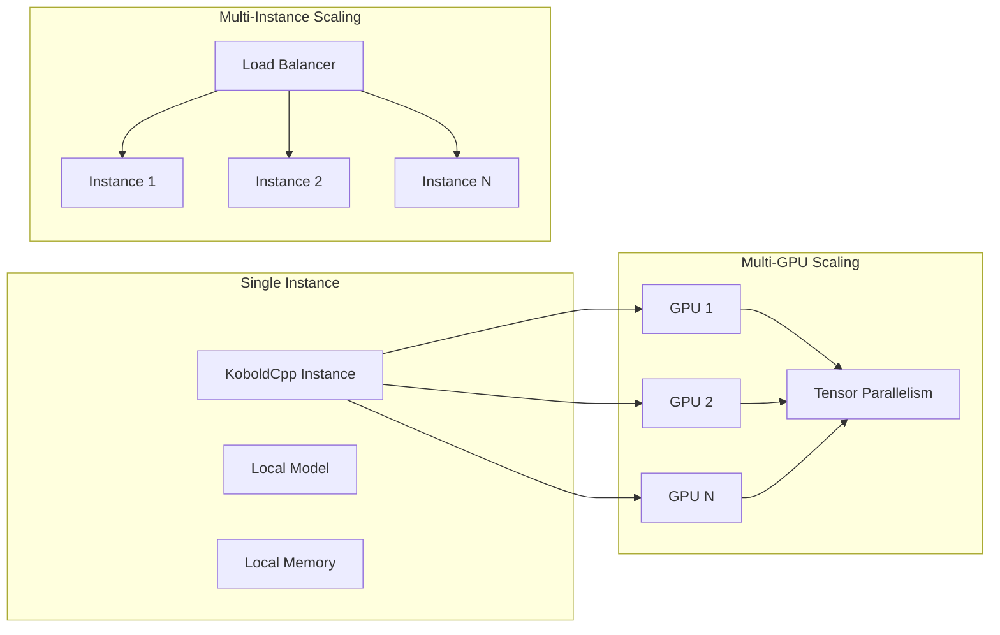

## Security Considerations

### Security Architecture

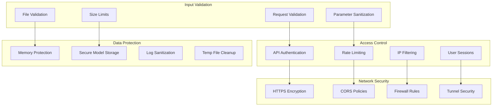

---

This architecture documentation provides a comprehensive technical overview of KoboldCpp's design and implementation. For implementation details and API specifications, refer to the [API Documentation](https://lite.koboldai.net/koboldcpp_api) and the [KoboldCpp Wiki](https://github.com/LostRuins/koboldcpp/wiki).