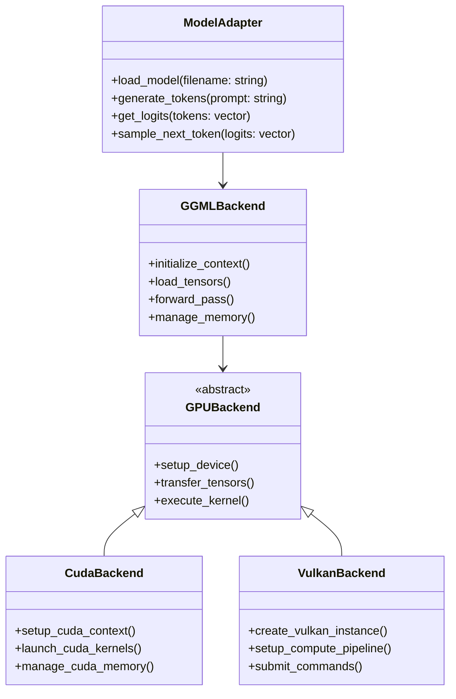

# KoboldCpp Developer Guide

This guide provides developers with essential information for contributing to, extending, and understanding the KoboldCpp codebase.

## Table of Contents

1. [Development Environment Setup](#development-environment-setup)
2. [Code Architecture](#code-architecture)
3. [Contributing Guidelines](#contributing-guidelines)
4. [Extending KoboldCpp](#extending-koboldcpp)
5. [Testing and Debugging](#testing-and-debugging)
6. [Performance Profiling](#performance-profiling)
7. [Common Development Tasks](#common-development-tasks)
8. [Troubleshooting](#troubleshooting)

## Development Environment Setup

### Prerequisites

- **Python 3.8+** (Python 3.12+ recommended)
- **C++ Compiler** (GCC 8+, Clang 10+, or MSVC 2019+)
- **CMake 3.16+** (for advanced builds)
- **Git** for version control

### Platform-Specific Setup

#### Linux Development

```bash
# Install system dependencies
sudo apt update
sudo apt install build-essential cmake git python3-dev

# Clone repository
git clone https://github.com/LostRuins/koboldcpp.git
cd koboldcpp

# Install Python dependencies
pip install -r requirements.txt

# Build C++ components
make LLAMA_PORTABLE=1

# Run in development mode
python koboldcpp.py --help
```

#### Windows Development

```cmd
# Install w64devkit from https://github.com/skeeto/w64devkit
# Clone repository
git clone https://github.com/LostRuins/koboldcpp.git
cd koboldcpp

# Install Python dependencies
pip install -r requirements.txt

# Build with w64devkit terminal
make LLAMA_PORTABLE=1

# For PyInstaller executable
pip install PyInstaller
make_pyinstaller.bat
```

#### macOS Development

```bash
# Install Xcode command line tools
xcode-select --install

# Clone and setup
git clone https://github.com/LostRuins/koboldcpp.git
cd koboldcpp
pip install -r requirements.txt

# Build with Metal support
make LLAMA_METAL=1 LLAMA_PORTABLE=1

# Run development server
python koboldcpp.py --model path/to/model.gguf
```

### Development Dependencies

```bash
# Additional development tools
pip install black flake8 mypy pytest pytest-asyncio
pip install jupyter notebook  # For analysis and prototyping
```

## Code Architecture

### Project Structure

```
koboldcpp/
├── koboldcpp.py          # Main application entry point
├── expose.cpp            # C++ Python bindings
├── gpttype_adapter.cpp   # Model type adapters
├── model_adapter.cpp     # Model loading and management
├── common/               # Shared utilities
├── ggml/                 # GGML library (submodule)
├── src/                  # Core C++ source files
├── include/              # Header files
├── vendor/               # Third-party dependencies
├── opencog/              # OpenCog cognitive architecture
├── examples/             # Example scripts and usage
├── tests/                # Test suite
└── tools/                # Development and conversion tools
```

### Key Modules Overview

#### Python Layer (`koboldcpp.py`)

```mermaid
graph TB
    subgraph "Python Application Structure"
        MAIN[main() function]
        CONFIG[Configuration Parsing]
        SERVER[HTTP Server Setup]
        HANDLERS[Request Handlers]
        MODEL_MGR[Model Manager]
        UTILS[Utilities]
    end
    
    subgraph "C++ Integration"
        CTYPES[ctypes Bindings]
        LIBRARY[Shared Library Loading]
        FUNCTION_CALLS[C++ Function Calls]
    end
    
    MAIN --> CONFIG
    CONFIG --> SERVER
    SERVER --> HANDLERS
    HANDLERS --> MODEL_MGR
    MODEL_MGR --> CTYPES
    CTYPES --> LIBRARY
    LIBRARY --> FUNCTION_CALLS
```

#### C++ Backend Architecture



### Data Flow Architecture

```mermaid
sequenceDiagram
    participant Client
    participant Python
    participant C++
    participant GGML
    participant GPU
    
    Client->>Python: HTTP Request
    Python->>Python: Parse & Validate
    Python->>C++: Call via ctypes
    C++->>GGML: Prepare tensors
    GGML->>GPU: Execute kernels
    GPU-->>GGML: Results
    GGML-->>C++: Processed output
    C++-->>Python: Return data
    Python-->>Client: HTTP Response
```

## Contributing Guidelines

### Code Style and Standards

#### Python Code Style

```python
# Use Black formatter with line length 88
# Follow PEP 8 conventions
# Type hints for public functions

from typing import List, Optional, Dict, Any
import asyncio

class ModelManager:
    """Manages model loading and inference operations."""
    
    def __init__(self, config: Dict[str, Any]) -> None:
        self.config = config
        self.loaded_models: Dict[str, Any] = {}
    
    async def load_model(self, model_path: str) -> Optional[str]:
        """Load a model from the specified path.
        
        Args:
            model_path: Path to the model file
            
        Returns:
            Model ID if successful, None otherwise
        """
        # Implementation here
        pass
```

#### C++ Code Style

```cpp
// Use clang-format configuration provided
// Follow Google C++ Style Guide
// RAII for resource management

#include "model_adapter.h"
#include <memory>
#include <vector>

namespace koboldcpp {

class ModelAdapter {
public:
    explicit ModelAdapter(const std::string& model_path);
    ~ModelAdapter() = default;
    
    // Move-only semantics
    ModelAdapter(const ModelAdapter&) = delete;
    ModelAdapter& operator=(const ModelAdapter&) = delete;
    ModelAdapter(ModelAdapter&&) = default;
    ModelAdapter& operator=(ModelAdapter&&) = default;
    
    std::vector<float> generate_logits(const std::vector<int>& tokens);
    
private:
    std::unique_ptr<ggml_context> context_;
    std::vector<ggml_tensor*> tensors_;
};

}  // namespace koboldcpp
```

### Git Workflow

```bash
# Create feature branch
git checkout -b feature/new-backend-support

# Make changes with clear commit messages
git add .
git commit -m "feat: add Vulkan backend support for AMD GPUs

- Implement Vulkan compute shader integration
- Add device detection and selection
- Update build system for Vulkan SDK
- Add comprehensive error handling

Fixes #123"

# Push and create PR
git push origin feature/new-backend-support
```

### Pull Request Guidelines

1. **Clear Description**: Explain what the PR does and why
2. **Test Coverage**: Include tests for new functionality
3. **Documentation**: Update relevant documentation
4. **Performance**: Consider performance implications
5. **Backward Compatibility**: Maintain API compatibility when possible

## Extending KoboldCpp

### Adding New Model Architectures

#### 1. Create Model Adapter

```cpp
// model_adapters/new_architecture.cpp
#include "model_adapter.h"

class NewArchitectureAdapter : public ModelAdapter {
public:
    explicit NewArchitectureAdapter(const std::string& model_path)
        : ModelAdapter(model_path) {
        architecture_type_ = "new_architecture";
    }
    
    bool load_model() override {
        // Load model-specific components
        load_embeddings();
        load_attention_layers();
        load_output_layer();
        return true;
    }
    
    std::vector<float> forward_pass(
        const std::vector<int>& tokens) override {
        // Implement forward pass logic
        auto embeddings = get_embeddings(tokens);
        auto hidden_states = process_layers(embeddings);
        return compute_logits(hidden_states);
    }
    
private:
    void load_embeddings();
    void load_attention_layers();
    void load_output_layer();
};
```

#### 2. Register in Factory

```cpp
// gpttype_adapter.cpp
#include "model_adapters/new_architecture.cpp"

std::unique_ptr<ModelAdapter> create_model_adapter(
    const std::string& architecture, 
    const std::string& model_path) {
    
    if (architecture == "new_architecture") {
        return std::make_unique<NewArchitectureAdapter>(model_path);
    }
    // ... other architectures
}
```

#### 3. Update Python Interface

```python
# In koboldcpp.py, update model detection
def detect_model_architecture(model_path):
    """Detect the architecture of a GGUF model."""
    try:
        # Read GGUF metadata
        metadata = read_gguf_metadata(model_path)
        arch = metadata.get('general.architecture', '')
        
        if arch == 'new_architecture':
            return 'new_architecture'
        # ... other architectures
        
    except Exception as e:
        print(f"Error detecting architecture: {e}")
        return None
```

### Adding New API Endpoints

#### 1. Define Route Handler

```python
# Add to koboldcpp.py
def handle_new_endpoint(self):
    """Handle new custom endpoint."""
    try:
        # Parse request
        data = json.loads(self.rfile.read(int(self.headers['Content-Length'])))
        
        # Validate input
        if not self.validate_request(data):
            self.send_error(400, "Invalid request")
            return
        
        # Process request
        result = self.process_new_feature(data)
        
        # Send response
        self.send_json_response(result)
        
    except Exception as e:
        self.send_error(500, str(e))

def process_new_feature(self, data):
    """Process the new feature request."""
    # Implementation here
    return {"status": "success", "result": data}
```

#### 2. Register Route

```python
# In the request routing section
if self.path.startswith('/api/new-endpoint'):
    return self.handle_new_endpoint()
```

### Adding Custom GGML Operations

#### 1. Define Operation

```cpp
// In custom_operations.cpp
ggml_tensor * ggml_custom_attention(
    struct ggml_context * ctx,
    struct ggml_tensor  * query,
    struct ggml_tensor  * key,
    struct ggml_tensor  * value,
    float scale) {
    
    GGML_ASSERT(ggml_are_same_shape(query, key));
    
    struct ggml_tensor * result = ggml_new_tensor(ctx, GGML_TYPE_F32, 
                                                  query->n_dims, query->ne);
    
    result->op = GGML_OP_CUSTOM_ATTENTION;
    result->src[0] = query;
    result->src[1] = key;
    result->src[2] = value;
    
    // Store scale parameter
    *(float*)(result->op_params) = scale;
    
    return result;
}
```

#### 2. Implement Compute Function

```cpp
void ggml_compute_custom_attention(
    const struct ggml_compute_params * params,
    const struct ggml_tensor * src0,  // query
    const struct ggml_tensor * src1,  // key  
    const struct ggml_tensor * src2,  // value
    struct ggml_tensor * dst) {
    
    if (params->type == GGML_TASK_INIT || params->type == GGML_TASK_FINALIZE) {
        return;
    }
    
    float scale = *(float*)(dst->op_params);
    
    // Implement attention computation
    // dst = softmax(query @ key.T * scale) @ value
    compute_scaled_dot_product_attention(src0, src1, src2, dst, scale);
}
```

## Testing and Debugging

### Unit Testing Framework

```python
# tests/test_model_loading.py
import pytest
import tempfile
import os
from unittest.mock import Mock, patch

from koboldcpp import ModelManager

class TestModelLoading:
    @pytest.fixture
    def model_manager(self):
        config = {"model_path": "/tmp/test_model.gguf"}
        return ModelManager(config)
    
    def test_load_valid_model(self, model_manager):
        """Test loading a valid GGUF model."""
        with patch('koboldcpp.load_gguf_model') as mock_load:
            mock_load.return_value = True
            result = model_manager.load_model("test_model.gguf")
            assert result is not None
            mock_load.assert_called_once()
    
    def test_load_invalid_model(self, model_manager):
        """Test handling of invalid model files."""
        with patch('koboldcpp.load_gguf_model') as mock_load:
            mock_load.side_effect = ValueError("Invalid model format")
            result = model_manager.load_model("invalid_model.gguf")
            assert result is None

    @pytest.mark.asyncio
    async def test_async_model_loading(self, model_manager):
        """Test asynchronous model loading."""
        with patch('koboldcpp.async_load_model') as mock_async_load:
            mock_async_load.return_value = "model_id_123"
            result = await model_manager.async_load_model("test_model.gguf")
            assert result == "model_id_123"
```

### Integration Testing

```python
# tests/test_api_integration.py
import requests
import pytest
from unittest import TestCase

class TestAPIIntegration(TestCase):
    BASE_URL = "http://localhost:5001"
    
    @classmethod
    def setUpClass(cls):
        """Start KoboldCpp server for testing."""
        # Start server in test mode
        pass
    
    def test_health_endpoint(self):
        """Test server health check."""
        response = requests.get(f"{self.BASE_URL}/api/health")
        self.assertEqual(response.status_code, 200)
        data = response.json()
        self.assertIn("status", data)
        self.assertEqual(data["status"], "ok")
    
    def test_generate_text(self):
        """Test text generation endpoint."""
        payload = {
            "prompt": "The quick brown fox",
            "max_tokens": 10,
            "temperature": 0.7
        }
        response = requests.post(f"{self.BASE_URL}/api/generate", json=payload)
        self.assertEqual(response.status_code, 200)
        data = response.json()
        self.assertIn("text", data)
        self.assertIsInstance(data["text"], str)
```

### Debugging Tools

#### GDB Debugging

```bash
# Compile with debug symbols
make LLAMA_DEBUG=1

# Run with GDB
gdb python
(gdb) run koboldcpp.py --model model.gguf
(gdb) break expose.cpp:123
(gdb) continue
(gdb) print variable_name
(gdb) backtrace
```

#### Memory Debugging

```bash
# Valgrind memory checking
valgrind --tool=memcheck --leak-check=full \
  python koboldcpp.py --model model.gguf

# AddressSanitizer
make LLAMA_ASAN=1
python koboldcpp.py --model model.gguf
```

#### Performance Profiling

```bash
# Profile Python code
python -m cProfile -o profile.out koboldcpp.py --model model.gguf
python -c "import pstats; p=pstats.Stats('profile.out'); p.sort_stats('cumulative').print_stats(20)"

# Profile C++ code with perf
perf record -g python koboldcpp.py --model model.gguf
perf report
```

## Performance Profiling

### Benchmarking Framework

```python
# tools/benchmark.py
import time
import statistics
from typing import List, Dict, Any

class KoboldCppBenchmark:
    def __init__(self, model_path: str):
        self.model_path = model_path
        self.results: Dict[str, List[float]] = {}
    
    def benchmark_token_generation(self, 
                                 prompt: str, 
                                 num_tokens: int = 100,
                                 iterations: int = 10) -> Dict[str, float]:
        """Benchmark token generation performance."""
        times = []
        
        for _ in range(iterations):
            start_time = time.perf_counter()
            
            # Generate tokens
            self.generate_tokens(prompt, num_tokens)
            
            end_time = time.perf_counter()
            times.append(end_time - start_time)
        
        return {
            "mean_time": statistics.mean(times),
            "std_dev": statistics.stdev(times),
            "min_time": min(times),
            "max_time": max(times),
            "tokens_per_second": num_tokens / statistics.mean(times)
        }
    
    def benchmark_model_loading(self) -> Dict[str, float]:
        """Benchmark model loading time."""
        start_time = time.perf_counter()
        self.load_model(self.model_path)
        end_time = time.perf_counter()
        
        return {
            "loading_time": end_time - start_time
        }
```

### Memory Usage Analysis

```python
# tools/memory_profiler.py
import psutil
import matplotlib.pyplot as plt
from typing import List, Tuple

class MemoryProfiler:
    def __init__(self):
        self.memory_usage: List[Tuple[float, float]] = []
    
    def start_monitoring(self, interval: float = 0.1):
        """Start monitoring memory usage."""
        process = psutil.Process()
        start_time = time.time()
        
        while True:
            current_time = time.time() - start_time
            memory_mb = process.memory_info().rss / 1024 / 1024
            self.memory_usage.append((current_time, memory_mb))
            time.sleep(interval)
    
    def plot_memory_usage(self, filename: str = "memory_usage.png"):
        """Plot memory usage over time."""
        times, memory = zip(*self.memory_usage)
        
        plt.figure(figsize=(12, 6))
        plt.plot(times, memory, linewidth=2)
        plt.xlabel("Time (seconds)")
        plt.ylabel("Memory Usage (MB)")
        plt.title("KoboldCpp Memory Usage Over Time")
        plt.grid(True, alpha=0.3)
        plt.savefig(filename, dpi=300, bbox_inches='tight')
```

## Common Development Tasks

### Adding New Sampling Methods

```cpp
// In sampling.cpp
float sample_top_k_top_p_typical(
    const std::vector<float>& logits,
    int top_k,
    float top_p,
    float typical_p,
    float temperature,
    std::mt19937& rng) {
    
    // Apply temperature
    std::vector<float> scaled_logits = logits;
    for (auto& logit : scaled_logits) {
        logit /= temperature;
    }
    
    // Apply typical sampling
    std::vector<std::pair<float, int>> prob_index_pairs;
    softmax_and_pair(scaled_logits, prob_index_pairs);
    apply_typical_sampling(prob_index_pairs, typical_p);
    
    // Apply top-k filtering
    apply_top_k_filtering(prob_index_pairs, top_k);
    
    // Apply top-p (nucleus) sampling
    apply_top_p_filtering(prob_index_pairs, top_p);
    
    // Sample from remaining candidates
    return sample_from_candidates(prob_index_pairs, rng);
}
```

### Model Quantization Integration

```python
# tools/quantize_model.py
def quantize_model(input_path: str, 
                   output_path: str, 
                   quantization_type: str = "q4_k_m"):
    """Quantize a GGUF model to reduce size and improve performance."""
    
    quantization_types = {
        "q4_0": QuantizationType.Q4_0,
        "q4_1": QuantizationType.Q4_1,
        "q4_k_m": QuantizationType.Q4_K_M,
        "q4_k_s": QuantizationType.Q4_K_S,
        "q8_0": QuantizationType.Q8_0,
    }
    
    if quantization_type not in quantization_types:
        raise ValueError(f"Unsupported quantization type: {quantization_type}")
    
    # Load model
    model = gguf.GGUFReader(input_path)
    
    # Quantize tensors
    quantized_model = quantize_tensors(
        model, 
        quantization_types[quantization_type]
    )
    
    # Save quantized model
    quantized_model.save(output_path)
    
    print(f"Model quantized from {input_path} to {output_path}")
    print(f"Original size: {os.path.getsize(input_path) / 1024**3:.2f} GB")
    print(f"Quantized size: {os.path.getsize(output_path) / 1024**3:.2f} GB")
```

## Troubleshooting

### Common Issues and Solutions

#### 1. Model Loading Failures

```python
def diagnose_model_loading_issue(model_path: str):
    """Diagnose common model loading issues."""
    
    if not os.path.exists(model_path):
        return "Error: Model file does not exist"
    
    if not model_path.endswith('.gguf'):
        return "Error: File is not a GGUF model"
    
    try:
        # Check if file is readable
        with open(model_path, 'rb') as f:
            header = f.read(8)
            if header[:4] != b'GGUF':
                return "Error: Invalid GGUF file format"
    except PermissionError:
        return "Error: Permission denied reading model file"
    except Exception as e:
        return f"Error: {str(e)}"
    
    # Check available memory
    import psutil
    memory_gb = psutil.virtual_memory().available / 1024**3
    model_size_gb = os.path.getsize(model_path) / 1024**3
    
    if model_size_gb > memory_gb * 0.8:
        return f"Warning: Model size ({model_size_gb:.1f} GB) may exceed available memory ({memory_gb:.1f} GB)"
    
    return "Model appears to be valid"
```

#### 2. GPU Backend Issues

```bash
# Check CUDA installation
nvidia-smi
nvcc --version

# Check Vulkan support
vulkaninfo | grep deviceName

# Check OpenCL support
clinfo
```

#### 3. Performance Issues

```python
def diagnose_performance_issues():
    """Diagnose common performance bottlenecks."""
    import psutil
    
    # Check CPU usage
    cpu_percent = psutil.cpu_percent(interval=1)
    if cpu_percent > 95:
        print("High CPU usage detected - consider reducing threads")
    
    # Check memory usage
    memory = psutil.virtual_memory()
    if memory.percent > 90:
        print("High memory usage - consider quantization or smaller model")
    
    # Check GPU utilization (if available)
    try:
        import pynvml
        pynvml.nvmlInit()
        handle = pynvml.nvmlDeviceGetHandleByIndex(0)
        util = pynvml.nvmlDeviceGetUtilizationRates(handle)
        if util.gpu < 50:
            print("Low GPU utilization - check layer offloading settings")
    except:
        pass
```

### Debug Configuration

```python
# Add to koboldcpp.py for debug mode
def setup_debug_logging():
    """Setup comprehensive debug logging."""
    import logging
    
    logging.basicConfig(
        level=logging.DEBUG,
        format='%(asctime)s - %(name)s - %(levelname)s - %(message)s',
        handlers=[
            logging.FileHandler('koboldcpp_debug.log'),
            logging.StreamHandler()
        ]
    )
    
    # Log system information
    logging.info(f"Python version: {sys.version}")
    logging.info(f"Platform: {platform.platform()}")
    logging.info(f"CPU cores: {os.cpu_count()}")
    logging.info(f"Available memory: {psutil.virtual_memory().total / 1024**3:.1f} GB")
    
    # Log GPU information
    try:
        import pynvml
        pynvml.nvmlInit()
        device_count = pynvml.nvmlDeviceGetCount()
        for i in range(device_count):
            handle = pynvml.nvmlDeviceGetHandleByIndex(i)
            name = pynvml.nvmlDeviceGetName(handle).decode()
            memory = pynvml.nvmlDeviceGetMemoryInfo(handle)
            logging.info(f"GPU {i}: {name} ({memory.total / 1024**3:.1f} GB)")
    except:
        logging.info("No NVIDIA GPUs detected")
```

---

This developer guide provides comprehensive information for working with the KoboldCpp codebase. For additional support, refer to the [KoboldCpp Wiki](https://github.com/LostRuins/koboldcpp/wiki) or join the [KoboldAI Discord](https://koboldai.org/discord).