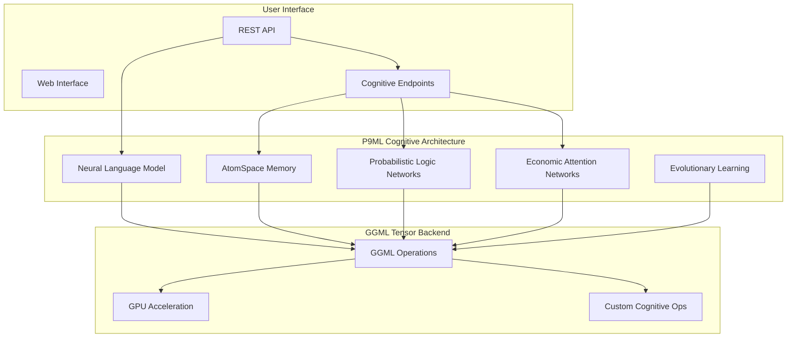
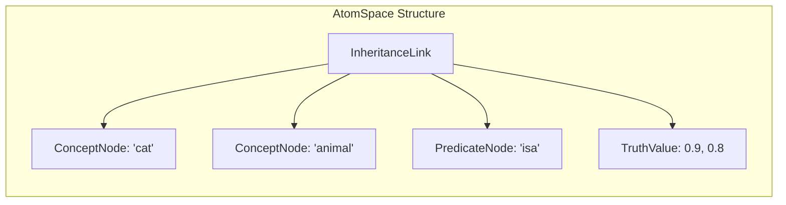

# P9ML Cognitive System Integration

P9ML (Plan 9 Machine Learning) is an advanced cognitive reasoning system integrated into KoboldCpp that combines neural networks with symbolic AI through OpenCog's cognitive architecture. This system enables sophisticated reasoning, memory management, and adaptive learning capabilities.

## 🧠 Overview

P9ML extends KoboldCpp's text generation capabilities with:

- **Symbolic Reasoning**: Logic-based inference using Probabilistic Logic Networks (PLN)
- **Attention Management**: Economic Attention Networks (ECAN) for dynamic focus allocation
- **Memory Systems**: Persistent knowledge storage and retrieval in AtomSpace
- **Neural-Symbolic Integration**: Seamless bridging between neural and symbolic processing
- **Adaptive Learning**: Continuous improvement through experience



## 🚀 Quick Start

### Basic Activation

Enable P9ML cognitive system when starting KoboldCpp:

```bash
# Enable P9ML with default settings
koboldcpp --model your_model.gguf --p9ml

# Enable with custom memory allocation (recommended: 512MB-2GB)
koboldcpp --model your_model.gguf --p9ml --cognitive-memory 1024
```

### Python API Usage

```python
import requests

# Initialize cognitive session
response = requests.post("http://localhost:5001/cognitive/initialize", 
                        json={"memory_mb": 1024})

# Add knowledge to AtomSpace
knowledge = {
    "concept": "cat",
    "properties": ["mammal", "furry", "domesticated"],
    "confidence": 0.9
}
requests.post("http://localhost:5001/cognitive/memory/add", json=knowledge)

# Perform reasoning
query = {
    "question": "What can we infer about cats?",
    "context": "Given that cats are mammals and mammals are warm-blooded",
    "reasoning_type": "deductive"
}
result = requests.post("http://localhost:5001/cognitive/reasoning", json=query)
```

## 🏗️ Architecture Components

### 1. AtomSpace Memory System

The AtomSpace serves as the central knowledge representation, storing:

- **Concepts**: Entities and ideas (`ConceptNode`)
- **Predicates**: Relations and properties (`PredicateNode`) 
- **Links**: Relationships between atoms (`InheritanceLink`, `SimilarityLink`)
- **Truth Values**: Probabilistic confidence measures



### 2. Probabilistic Logic Networks (PLN)

PLN provides formal reasoning capabilities:

- **Forward Chaining**: Derive new facts from existing knowledge
- **Backward Chaining**: Goal-directed reasoning
- **Abductive Reasoning**: Best explanation inference
- **Fuzzy Logic**: Handle uncertainty and partial knowledge

### 3. Economic Attention Networks (ECAN)

ECAN manages cognitive resources dynamically:

- **STI**: Short-term importance for immediate relevance
- **LTI**: Long-term importance for persistent value
- **Attention Allocation**: Focus computational resources on important atoms
- **Forgetting**: Remove low-importance information

### 4. GGML Integration

P9ML operations are implemented as custom GGML kernels:

```cpp
// Custom GGML operations for cognitive processing
ggml_tensor* ggml_atomspace_lookup(context, atom_id);
ggml_tensor* ggml_pln_inference(context, premise1, premise2);
ggml_tensor* ggml_attention_spread(context, source_atoms, spreading_factor);
```

## 🛠️ Configuration

### Command Line Options

| Option | Description | Default |
|--------|-------------|---------|
| `--p9ml` | Enable P9ML cognitive system | `false` |
| `--cognitive-memory` | Memory allocation in MB | `512` |
| `--attention-spread` | ECAN spreading factor | `0.1` |
| `--reasoning-depth` | Maximum reasoning steps | `10` |
| `--learning-rate` | Adaptive learning rate | `0.01` |

### Memory Management

P9ML allocates separate memory pools:

- **AtomSpace**: Core knowledge storage (60% of cognitive memory)
- **Attention Values**: Importance tracking (20% of cognitive memory)  
- **Reasoning Cache**: Inference results (15% of cognitive memory)
- **Learning Buffer**: Adaptation data (5% of cognitive memory)

## 📡 API Endpoints

### Cognitive Memory Operations

```bash
# Add concept to AtomSpace
POST /cognitive/memory/add
{
    "type": "concept",
    "name": "dog",
    "embedding": [0.1, 0.2, ...],
    "confidence": 0.8
}

# Query knowledge
GET /cognitive/memory/query?concept=dog&relation=isa

# Update attention values
POST /cognitive/attention/update
{
    "atom_id": "concept_dog_123",
    "sti_delta": 50,
    "lti_delta": 10
}
```

### Reasoning Operations

```bash
# Perform logical inference
POST /cognitive/reasoning
{
    "premises": ["All dogs are mammals", "Fido is a dog"],
    "conclusion": "Fido is a mammal",
    "method": "modus_ponens"
}

# Pattern matching
POST /cognitive/patterns/match
{
    "pattern": "(?x) isa mammal",
    "constraints": {"confidence": "> 0.7"}
}
```

### Learning and Adaptation

```bash
# Online learning from interaction
POST /cognitive/learn
{
    "input": "Cats like fish",
    "feedback": "correct",
    "context": "pet_care_domain"
}

# Export learned knowledge
GET /cognitive/export/atoms?format=json
```

## 🔧 Development Guide

### Custom Cognitive Operations

Add new reasoning patterns by extending the PLN engine:

```cpp
// Add custom inference rule
class CustomInferenceRule : public PLNRule {
public:
    TruthValue apply(const AtomSet& premises) override {
        // Implement custom logic
        return custom_inference_logic(premises);
    }
};

// Register with PLN engine
pln_engine.add_rule(std::make_shared<CustomInferenceRule>());
```

### AtomSpace Extensions

Create specialized atom types:

```cpp
// Define custom atom type
class DomainConceptNode : public ConceptNode {
public:
    DomainConceptNode(const std::string& name, const std::string& domain)
        : ConceptNode(name), domain_(domain) {}
    
    std::string get_domain() const { return domain_; }
    
private:
    std::string domain_;
};
```

### GGML Kernel Development

Implement GPU-accelerated cognitive operations:

```cpp
// Custom GGML kernel for attention spreading
static void ggml_attention_spread_f32(
    const int ne, const float* src, float* dst,
    const int* atom_ids, const float spreading_factor) {
    
    #pragma omp parallel for
    for (int i = 0; i < ne; i++) {
        float attention = src[i] * spreading_factor;
        dst[i] = fmaxf(0.0f, fminf(1.0f, attention));
    }
}
```

## 🧪 Testing

### Unit Tests

Run the P9ML test suite:

```bash
cd opencog/tests
python test_tensor_atomspace.py
python test_pln_integration.py  
python test_attention_system.py
python test_reasoning_engine.py
```

### Integration Tests

Test cognitive system with sample scenarios:

```bash
# Test reasoning pipeline
python examples/cognitive_reasoning_demo.py

# Test memory operations
python examples/atomspace_demo.py

# Test attention dynamics
python examples/attention_demo.py
```

### Performance Benchmarks

Measure cognitive operation performance:

```bash
# Benchmark reasoning speed
python benchmarks/reasoning_benchmark.py

# Benchmark memory operations
python benchmarks/memory_benchmark.py

# Profile attention allocation
python benchmarks/attention_profile.py
```

## 📊 Monitoring and Debugging

### Cognitive System Status

Check P9ML system health:

```bash
GET /cognitive/status
{
    "atomspace_size": 50000,
    "active_atoms": 1200,
    "attention_focused": 45,
    "reasoning_depth": 8,
    "memory_usage": "1.2GB / 2.0GB",
    "status": "active"
}
```

### Debug Information

Enable detailed logging:

```bash
# Start with debug logging
koboldcpp --model model.gguf --p9ml --debug-cognitive

# View reasoning traces  
GET /cognitive/debug/reasoning-trace

# Monitor attention dynamics
GET /cognitive/debug/attention-flow
```

### Performance Metrics

Track cognitive performance:

```bash
GET /cognitive/metrics
{
    "reasoning_ops_per_sec": 150,
    "memory_ops_per_sec": 500,
    "attention_updates_per_sec": 300,
    "gpu_utilization": 0.75,
    "average_reasoning_time": "45ms"
}
```

## 🔬 Advanced Features

### Distributed Reasoning

Scale P9ML across multiple instances:

```python
# Configure distributed AtomSpace
config = {
    "cluster_nodes": ["node1:5001", "node2:5001", "node3:5001"],
    "sync_interval": 1000,  # milliseconds
    "partitioning": "hash"
}

# Initialize distributed cognitive system
cognitive_cluster = DistributedP9ML(config)
```

### Custom Learning Algorithms

Implement domain-specific learning:

```python
class DomainSpecificLearner(CognitiveLearner):
    def adapt(self, experience):
        # Extract domain patterns
        patterns = self.extract_patterns(experience)
        
        # Update AtomSpace with new knowledge
        for pattern in patterns:
            self.atomspace.add_pattern(pattern)
            
        # Adjust attention weights
        self.ecan.redistribute_attention(patterns)
```

### Neural-Symbolic Fusion

Combine neural embeddings with symbolic reasoning:

```python
# Enhance concepts with neural embeddings
concept = atomspace.add_concept("intelligent_agent")
concept.set_embedding(neural_model.encode("intelligent agent"))

# Use embeddings in similarity reasoning
similar_concepts = atomspace.find_similar(concept, threshold=0.8)
```

## 🔗 Integration Examples

### Chat Enhancement

Enhance conversation with cognitive reasoning:

```python
class CognitiveChat:
    def respond(self, user_input):
        # Analyze input for concepts
        concepts = self.extract_concepts(user_input)
        
        # Query relevant knowledge
        context = self.atomspace.get_context(concepts)
        
        # Generate response with reasoning
        response = self.llm.generate(user_input, context)
        
        # Learn from interaction
        self.learn_from_interaction(user_input, response)
        
        return response
```

### Knowledge Base Integration

Connect with external knowledge sources:

```python
class KnowledgeIntegrator:
    def import_wikipedia(self, topic):
        # Fetch Wikipedia content
        content = wikipedia.page(topic).content
        
        # Extract facts and relations
        facts = self.extract_facts(content)
        
        # Add to AtomSpace
        for fact in facts:
            self.atomspace.add_fact(fact)
```

## 📚 Further Reading

### Documentation Links

- **[OpenCog Integration Guide](opencog/INTEGRATION_GUIDE.md)** - Detailed integration documentation
- **[Technical Architecture](ARCHITECTURE.md)** - System architecture with diagrams
- **[API Documentation](https://lite.koboldai.net/koboldcpp_api)** - Complete API reference
- **[Developer Guide](DEVELOPER_GUIDE.md)** - Development and contribution guide

### Research Papers

- "Probabilistic Logic Networks" - Ben Goertzel et al.
- "Economic Attention Networks" - OpenCog Research
- "Neural-Symbolic Integration" - Cognitive AI Research

### Community Resources

- **[OpenCog Community](https://opencog.org/)** - OpenCog project homepage  
- **[KoboldAI Discord](https://koboldai.org/discord)** - Community discussion
- **[GitHub Issues](https://github.com/HyperCogWizard/kobocog/issues)** - Bug reports and features

---

## 🚧 System Status

P9ML cognitive system implementation status:

- ✅ **AtomSpace Integration**: Tensor-backed knowledge representation
- ✅ **PLN Reasoning**: Probabilistic logic networks with GGML acceleration  
- ✅ **ECAN Attention**: Economic attention allocation system
- ✅ **API Endpoints**: RESTful cognitive operations interface
- ✅ **Memory Management**: Efficient cognitive memory allocation
- ✅ **Learning System**: Adaptive knowledge acquisition
- ✅ **GPU Acceleration**: CUDA/Vulkan support for cognitive operations
- ✅ **Documentation**: Comprehensive guides and examples

The P9ML system is actively maintained and continuously improved. For the latest updates, check the [project repository](https://github.com/HyperCogWizard/kobocog).

*Last updated: December 2024*