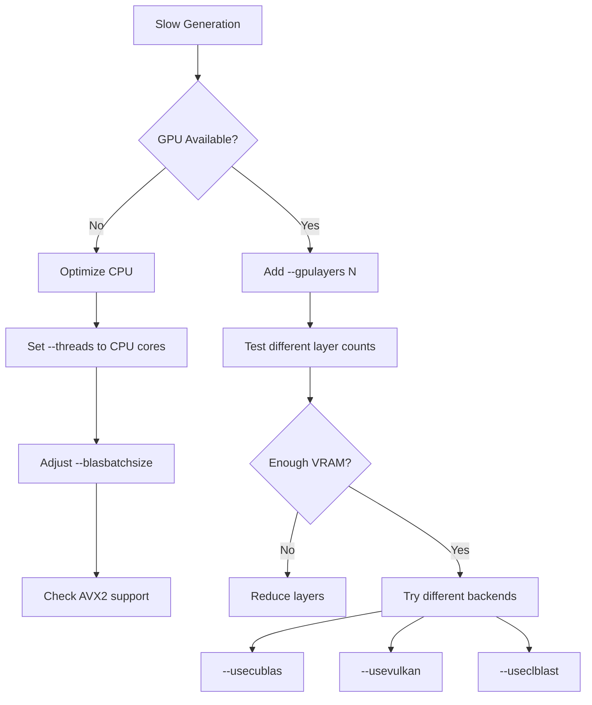

# KoboldCpp Troubleshooting Guide

This guide helps resolve common issues when using KoboldCpp across different platforms and configurations.

## Table of Contents

1. [Quick Diagnostics](#quick-diagnostics)
2. [Installation Issues](#installation-issues)
3. [Model Loading Problems](#model-loading-problems)
4. [Performance Issues](#performance-issues)
5. [GPU Acceleration Problems](#gpu-acceleration-problems)
6. [Network and API Issues](#network-and-api-issues)
7. [Memory and Resource Issues](#memory-and-resource-issues)
8. [Platform-Specific Issues](#platform-specific-issues)
9. [Build and Compilation Issues](#build-and-compilation-issues)
10. [Advanced Debugging](#advanced-debugging)

## Quick Diagnostics

### System Information Check

```bash
# Check system resources
python -c "
import psutil, platform, sys
print(f'OS: {platform.system()} {platform.release()}')
print(f'Python: {sys.version}')
print(f'CPU Cores: {psutil.cpu_count()}')
print(f'RAM: {psutil.virtual_memory().total / 1024**3:.1f} GB')
print(f'Available RAM: {psutil.virtual_memory().available / 1024**3:.1f} GB')
"

# Check GPU availability
python -c "
try:
    import subprocess
    result = subprocess.run(['nvidia-smi'], capture_output=True, text=True)
    if result.returncode == 0:
        print('NVIDIA GPU detected')
        print(result.stdout)
    else:
        print('No NVIDIA GPU or nvidia-smi not found')
except:
    print('nvidia-smi not available')
"
```

### KoboldCpp Health Check

```bash
# Basic functionality test
python koboldcpp.py --help

# Test with minimal model (if available)
python koboldcpp.py --model small_model.gguf --threads 1 --contextsize 512 --prompt "Hello" --cli
```

## Installation Issues

### Missing Dependencies

#### Python Dependencies
```bash
# Reinstall requirements
pip install -r requirements.txt --force-reinstall

# Install specific missing packages
pip install numpy>=1.24.4 sentencepiece>=0.1.98 transformers>=4.34.0
```

#### System Dependencies (Linux)
```bash
# Ubuntu/Debian
sudo apt update
sudo apt install build-essential cmake git python3-dev libopenblas-dev

# Arch Linux
sudo pacman -S base-devel cmake git python blas

# CentOS/RHEL
sudo yum groupinstall "Development Tools"
sudo yum install cmake git python3-devel openblas-devel
```

### Binary Execution Issues

#### Windows
```cmd
REM Permission issues
icacls koboldcpp.exe /grant %username%:F

REM Antivirus blocking (add exception)
REM Windows Defender: Settings > Virus & threat protection > Exclusions

REM Missing Visual C++ Redistributable
REM Download from: https://aka.ms/vs/17/release/vc_redist.x64.exe
```

#### Linux
```bash
# Permission issues
chmod +x koboldcpp-linux-x64

# Missing shared libraries
ldd koboldcpp-linux-x64  # Check dependencies
sudo apt install libc6 libgcc-s1 libstdc++6  # Common missing libs

# Compatibility mode for older systems
./koboldcpp-linux-x64-oldpc  # Use old PC version
```

#### macOS
```bash
# Security settings
sudo spctl --assess --verbose koboldcpp-mac-arm64
sudo xattr -r -d com.apple.quarantine koboldcpp-mac-arm64

# Codesigning issues (if needed)
codesign --force --deep --sign - koboldcpp-mac-arm64
```

## Model Loading Problems

### File Format Issues

```python
# Check if file is valid GGUF
def check_gguf_file(filename):
    try:
        with open(filename, 'rb') as f:
            header = f.read(8)
            if header[:4] != b'GGUF':
                return f"Invalid GGUF header: {header[:4]}"
            
            version = int.from_bytes(header[4:8], 'little')
            print(f"GGUF version: {version}")
            return "Valid GGUF file"
    except Exception as e:
        return f"Error reading file: {e}"

# Usage
print(check_gguf_file("your_model.gguf"))
```

### Model Size vs Memory

```python
# Calculate memory requirements
def estimate_memory_usage(model_path, context_size=2048):
    import os
    
    model_size_gb = os.path.getsize(model_path) / 1024**3
    
    # Rough estimates
    base_memory = model_size_gb * 1.2  # Model + overhead
    context_memory = context_size * 4 * 2 / 1024**3  # Rough KV cache
    
    total_estimated = base_memory + context_memory
    
    print(f"Model size: {model_size_gb:.1f} GB")
    print(f"Estimated base memory: {base_memory:.1f} GB")
    print(f"Context memory: {context_memory:.1f} GB")
    print(f"Total estimated: {total_estimated:.1f} GB")
    
    available = psutil.virtual_memory().available / 1024**3
    print(f"Available memory: {available:.1f} GB")
    
    if total_estimated > available * 0.8:
        print("⚠️  Warning: May not fit in memory")
        print("Solutions:")
        print("- Use a smaller model")
        print("- Reduce context size with --contextsize")
        print("- Use GPU offloading with --gpulayers")
        print("- Use quantized model (Q4_K_M or Q8_0)")
    
    return total_estimated

# Usage
estimate_memory_usage("model.gguf", context_size=4096)
```

### Unsupported Architecture

```bash
# Check model architecture
python -c "
import gguf
reader = gguf.GGUFReader('model.gguf')
metadata = reader.get_metadata()
arch = metadata.get('general.architecture', 'unknown')
print(f'Architecture: {arch}')

# List all metadata for debugging
for key, value in metadata.items():
    if isinstance(value, (str, int, float, bool)):
        print(f'{key}: {value}')
"
```

## Performance Issues

### Slow Generation Speed



#### CPU Performance Optimization

```bash
# Check CPU capabilities
python -c "
import platform, subprocess, os
print(f'CPU: {platform.processor()}')
print(f'Cores: {os.cpu_count()}')

# Check for AVX2 support
try:
    result = subprocess.run(['lscpu'], capture_output=True, text=True)
    if 'avx2' in result.stdout.lower():
        print('AVX2: Supported')
    else:
        print('AVX2: Not supported (use --noavx2)')
except:
    print('Cannot check AVX2 support')
"

# Optimal CPU settings
python koboldcpp.py --model model.gguf \
    --threads $(nproc) \
    --blasbatchsize 512 \
    --contextsize 2048
```

#### GPU Performance Optimization

```bash
# Test GPU memory
nvidia-smi --query-gpu=memory.total,memory.free --format=csv,noheader,nounits

# Progressive layer testing
for layers in 10 20 30 40; do
    echo "Testing $layers layers..."
    timeout 60 python koboldcpp.py --model model.gguf \
        --gpulayers $layers --usecublas --prompt "Test" --cli
done
```

### High Memory Usage

```python
# Monitor memory usage
import psutil
import time
import matplotlib.pyplot as plt

def monitor_memory(duration=300):
    """Monitor memory usage for duration seconds."""
    times = []
    memory_usage = []
    start_time = time.time()
    
    while time.time() - start_time < duration:
        current_time = time.time() - start_time
        memory_mb = psutil.virtual_memory().used / 1024 / 1024
        
        times.append(current_time)
        memory_usage.append(memory_mb)
        
        print(f"Time: {current_time:.1f}s, Memory: {memory_mb:.0f}MB")
        time.sleep(5)
    
    # Plot results
    plt.figure(figsize=(10, 6))
    plt.plot(times, memory_usage)
    plt.xlabel("Time (seconds)")
    plt.ylabel("Memory Usage (MB)")
    plt.title("KoboldCpp Memory Usage")
    plt.grid(True)
    plt.savefig("memory_usage.png")
    plt.show()

# Run while KoboldCpp is running
monitor_memory(300)  # Monitor for 5 minutes
```

## GPU Acceleration Problems

### CUDA Issues

```bash
# Check CUDA installation
nvcc --version
nvidia-smi

# Check CUDA libraries
python -c "
import ctypes
try:
    lib = ctypes.CDLL('libcuda.so.1')
    print('CUDA runtime found')
except:
    print('CUDA runtime not found')
    
try:
    lib = ctypes.CDLL('libcublas.so.11')
    print('cuBLAS found')
except:
    print('cuBLAS not found')
"

# Test CUDA functionality
python koboldcpp.py --model model.gguf --usecublas --gpulayers 1 --prompt "Test" --cli
```

**Common CUDA Solutions:**
- Install CUDA Toolkit from NVIDIA
- Update GPU drivers
- Check CUDA version compatibility
- Verify CUDA libraries in PATH/LD_LIBRARY_PATH

### Vulkan Issues

```bash
# Check Vulkan support
vulkaninfo | head -20

# List Vulkan devices
python -c "
try:
    import vulkan as vk
    print('Vulkan support available')
except ImportError:
    print('Install vulkan package: pip install vulkan')
"

# Test Vulkan backend
python koboldcpp.py --model model.gguf --usevulkan --gpulayers 10 --prompt "Test" --cli
```

**Common Vulkan Solutions:**
- Install Vulkan SDK
- Update GPU drivers
- Check device compatibility
- Try different device IDs with `--usevulkan 0 1 2`

### CLBlast Issues

```bash
# Check OpenCL support
clinfo

# Linux: Install CLBlast
sudo apt install libclblast-dev  # Debian/Ubuntu
sudo pacman -S clblast          # Arch Linux

# Test CLBlast
python koboldcpp.py --model model.gguf --useclblast 0 0 --prompt "Test" --cli
```

## Network and API Issues

### Port Already in Use

```bash
# Find process using port 5001
lsof -i :5001                    # Linux/macOS
netstat -ano | findstr :5001     # Windows

# Kill process
kill -9 <PID>                    # Linux/macOS
taskkill /PID <PID> /F          # Windows

# Use different port
python koboldcpp.py --port 5002
```

### API Connection Issues

```python
# Test API connectivity
import requests
import json

def test_api_connection(base_url="http://localhost:5001"):
    try:
        # Test health endpoint
        response = requests.get(f"{base_url}/api/v1/model", timeout=10)
        print(f"Status: {response.status_code}")
        print(f"Response: {response.text}")
        
        # Test generation
        payload = {
            "prompt": "Hello",
            "max_tokens": 5,
            "temperature": 0.7
        }
        response = requests.post(f"{base_url}/api/v1/generate", 
                               json=payload, timeout=30)
        print(f"Generation test: {response.status_code}")
        
    except requests.exceptions.ConnectionError:
        print("Connection failed - check if KoboldCpp is running")
    except requests.exceptions.Timeout:
        print("Request timed out - model may be loading")
    except Exception as e:
        print(f"Error: {e}")

test_api_connection()
```

### CORS Issues

```bash
# Allow CORS for web development
python koboldcpp.py --model model.gguf --host 0.0.0.0 --port 5001
```

## Memory and Resource Issues

### Out of Memory (OOM)

```python
# Memory-efficient loading strategies
def suggest_memory_config(model_path):
    import os
    model_size_gb = os.path.getsize(model_path) / 1024**3
    available_gb = psutil.virtual_memory().available / 1024**3
    
    print(f"Model size: {model_size_gb:.1f} GB")
    print(f"Available memory: {available_gb:.1f} GB")
    
    if model_size_gb > available_gb * 0.6:
        print("\n🔧 Suggested optimizations:")
        print("1. Use GPU offloading:")
        print(f"   --gpulayers 20 --usecublas")
        print("2. Reduce context size:")
        print(f"   --contextsize 1024")
        print("3. Use smaller batch size:")
        print(f"   --blasbatchsize 128")
        print("4. Use memory mapping:")
        print(f"   --usemmap")
        print("5. Consider smaller/quantized model")
    else:
        print("✅ Model should fit in memory")

suggest_memory_config("model.gguf")
```

### Swap Usage Issues

```bash
# Check swap usage
free -h                          # Linux
vm_stat                         # macOS
wmic OS get TotalSwapSpaceSize  # Windows

# Reduce swap usage
echo 1 > /proc/sys/vm/swappiness  # Linux (temporary)
```

## Platform-Specific Issues

### Windows Issues

#### DLL Loading Errors
```cmd
REM Install Visual C++ Redistributable
REM Download: https://aka.ms/vs/17/release/vc_redist.x64.exe

REM Register DLLs manually
regsvr32 vcruntime140.dll
regsvr32 msvcp140.dll
```

#### Windows Defender Issues
```powershell
# Add exclusion (run as administrator)
Add-MpPreference -ExclusionPath "C:\path\to\koboldcpp.exe"
Add-MpPreference -ExclusionProcess "koboldcpp.exe"
```

### Linux Issues

#### Library Path Issues
```bash
# Add library paths
export LD_LIBRARY_PATH=/usr/local/lib:$LD_LIBRARY_PATH

# Find missing libraries
ldd koboldcpp-linux-x64

# Install missing libraries
sudo apt install libc6-dev libstdc++6
```

#### Permission Issues
```bash
# Fix permissions
chmod +x koboldcpp-linux-x64
sudo chown $USER:$USER koboldcpp-linux-x64
```

### macOS Issues

#### Gatekeeper Issues
```bash
# Bypass gatekeeper
sudo spctl --master-disable
xattr -cr koboldcpp-mac-arm64
sudo spctl --master-enable

# Alternative: remove quarantine
xattr -d com.apple.quarantine koboldcpp-mac-arm64
```

#### Rosetta Issues (Intel Macs)
```bash
# Install Rosetta 2
softwareupdate --install-rosetta

# Force Rosetta
arch -x86_64 ./koboldcpp-mac-arm64
```

## Build and Compilation Issues

### Missing Build Tools

#### Linux
```bash
# Essential build tools
sudo apt install build-essential cmake git

# For GPU support
sudo apt install nvidia-cuda-dev    # CUDA
sudo apt install libvulkan-dev      # Vulkan
sudo apt install libclblast-dev     # CLBlast
```

#### Windows
```cmd
REM Install Visual Studio Build Tools
REM Download: https://visualstudio.microsoft.com/downloads/#build-tools-for-visual-studio-2019

REM Install w64devkit for GCC
REM Download: https://github.com/skeeto/w64devkit/releases
```

#### macOS
```bash
# Install Xcode command line tools
xcode-select --install

# Install Homebrew dependencies
brew install cmake git
```

### Compilation Errors

#### Common Fixes
```bash
# Clean build
make clean
rm -rf build/

# Force rebuild
make LLAMA_PORTABLE=1 -j$(nproc)

# Debug build
make LLAMA_DEBUG=1
```

#### CUDA Compilation Issues
```bash
# Check CUDA version compatibility
nvcc --version
cat /usr/local/cuda/version.txt

# Build with specific CUDA version
make LLAMA_CUBLAS=1 CUDA_PATH=/usr/local/cuda-11.8
```

## Advanced Debugging

### Logging and Verbosity

```bash
# Enable debug mode
python koboldcpp.py --debugmode 1 --model model.gguf

# Capture logs
python koboldcpp.py --model model.gguf 2>&1 | tee koboldcpp.log

# Analyze logs
grep -i error koboldcpp.log
grep -i warning koboldcpp.log
```

### Performance Profiling

```bash
# CPU profiling
python -m cProfile -o profile.out koboldcpp.py --model model.gguf
python -c "import pstats; p=pstats.Stats('profile.out'); p.sort_stats('cumulative').print_stats(10)"

# Memory profiling
python -m memory_profiler koboldcpp.py --model model.gguf

# GPU profiling (NVIDIA)
nvprof python koboldcpp.py --model model.gguf --usecublas
```

### System Tracing

#### Linux
```bash
# System call tracing
strace -o trace.out python koboldcpp.py --model model.gguf

# File access tracing
strace -e trace=file python koboldcpp.py --model model.gguf

# Network tracing
netstat -tulpn | grep python
```

#### Windows
```cmd
REM Process Monitor (download ProcMon from Microsoft Sysinternals)
procmon.exe

REM Performance Toolkit
wpa.exe
```

### Core Dump Analysis

```bash
# Enable core dumps (Linux)
ulimit -c unlimited
echo core > /proc/sys/kernel/core_pattern

# Analyze with GDB
gdb python core
(gdb) bt
(gdb) info registers
(gdb) print variable_name
```

## Getting Help

If these troubleshooting steps don't resolve your issue:

1. **Search existing issues**: [GitHub Issues](https://github.com/LostRuins/koboldcpp/issues)
2. **Check the Wiki**: [KoboldCpp Wiki](https://github.com/LostRuins/koboldcpp/wiki)
3. **Join Discord**: [KoboldAI Discord](https://koboldai.org/discord)
4. **Create new issue** with:
   - System information
   - Complete error messages
   - Steps to reproduce
   - Relevant logs

### Issue Template

```
**System Information:**
- OS: [e.g., Windows 11, Ubuntu 22.04]
- Python version: [e.g., 3.11.5]
- KoboldCpp version: [e.g., 1.75]
- GPU: [e.g., RTX 4090, M1 Max]

**Problem Description:**
[Clear description of the issue]

**Steps to Reproduce:**
1. [First step]
2. [Second step]
3. [Error occurs]

**Expected Behavior:**
[What should happen]

**Actual Behavior:**
[What actually happens]

**Error Messages:**
```
[Paste complete error messages here]
```

**Configuration:**
[Command line arguments or config used]

**Additional Context:**
[Any other relevant information]
```

---

For more help, visit the [KoboldCpp Wiki](https://github.com/LostRuins/koboldcpp/wiki) or join our [Discord community](https://koboldai.org/discord).